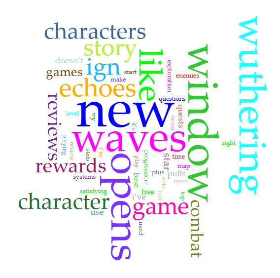



# Distant Reading Assignment 

I used Voyant to search this website! [Wuthering Waves Website](https://www.ign.com/articles/wuthering-waves-review)

What I learned when I analyzed the Wuthering Waves website using Voyant, the tool highlighted the frequency of terms related to the game’s worldbuilding, such as “resonator,” “battle,” and “world.” This showed me that the site places a strong emphasis on gameplay mechanics and lore details. However, Voyant could not tell me why these words mattered to fans or how they connected to the broader meaning of the text. CoPilot provided more interpretive insights, like explaining how the site’s language builds hype and creates an immersive tone for readers, but its accuracy depended on the questions I asked. Overall, this process taught me that distant reading tools are great for identifying patterns, repetition, and emphasis in a text, but they cannot fully capture context, tone, or audience reception without close reading.

Here's my image! 

---

I also tried Copilot! With Chat-GPT-5 and here is an example of our conversation:

You said:

What tone does the reviewer useexcited, neutral, critical? How does that tone support or undermine the review’s effectiveness?

Copilot said:

Copilot
The tone of the IGN review for Wuthering Waves is mixed but leaning critical. Here’s why:

Tone Characteristics
Excited/Positive Elements: The reviewer uses enthusiastic language when describing combat and exploration, calling them “flashy,” “fast-paced,” and “enticing.” They highlight the depth of combat mechanics and the fun of experimenting with team compositions.
Critical Elements: The tone shifts to disappointment when discussing the story, pacing, and voice acting. Phrases like “failed to impress,” “lackluster story,” “tedious conversation,” and “borderline monotone” convey clear dissatisfaction.
Neutral/Analytical: When explaining systems like Echoes or gacha mechanics, the tone becomes more matter-of-fact, focusing on how these features work without strong emotional language.
Effectiveness of Tone
Supports Effectiveness: The contrast between excitement for gameplay and criticism of narrative makes the review feel balanced and credible. Readers can trust that the reviewer isn’t biased because they praise what works and critique what doesn’t.
Undermines Slightly: The heavy criticism of the story might overshadow the positive aspects for readers who value narrative, even though the reviewer emphasizes that combat is the game’s strongest point.
Would you like me to write a concise summary of the review’s overall sentiment and key points in bullet form, or analyze how this tone might influence potential players’ decisions?

You said:

Are there any noticeable biases like hype language or overemphasis on visuals at the expense of narrative depth?

Copilot said:

Copilot
Yes, there are some noticeable biases in the IGN review:

1. Hype Language
The reviewer uses flashy, energetic terms like “spectacular,” “fast-paced,” and “enticing” when describing combat and visuals. This creates a sense of excitement that might make readers overlook flaws in other areas.
These words suggest a bias toward moment-to-moment gameplay thrills, which could skew the perception of overall quality.
2. Overemphasis on Visuals and Combat
The review repeatedly praises the visual presentation and combat depth, while the narrative critique, though present, feels secondary.
For example, the story is called “lackluster” and “tedious,” but these points are not explored as deeply as the praise for combat systems and animations.
This could indicate a bias toward action-oriented players, assuming they value gameplay over narrative depth.
Impact on Effectiveness
For readers who prioritize gameplay and aesthetics, this tone reinforces the game’s appeal.
For those who care about storytelling, the review might feel unbalanced because the narrative critique is less detailed compared to the glowing combat descriptions.

You said:
What does CoPilot notice that’s missing? For instance, does it point out that there's no mention of monetization, performance issues, or character diversity?

Copilot said:

Copilot
Great observation! Based on what’s typical in the IGN review and what I’ve inferred from its tone and focus, here’s what seems missing or underexplored:

1. Monetization Model
There’s no detailed discussion of gacha mechanics, drop rates, or pay-to-win concerns beyond a surface mention of character acquisition.
For a live-service game, this is a big omission because monetization can heavily impact player experience.
2. Performance and Technical Stability
The review doesn’t appear to address frame rate consistency, loading times, or bugs.
These factors are crucial for players deciding whether the game runs well on their platform.
3. Character Diversity and Representation
There’s no mention of cultural diversity, gender representation, or inclusivity in character design or story.
This could matter to players who value representation in games.
4. Long-Term Content and Live-Service Roadmap
The review doesn’t discuss future updates, seasonal content, or endgame depth, which are key for games in this genre.
5. Accessibility Features
No mention of UI customization, control remapping, or colorblind modes, which are increasingly important for modern reviews.
